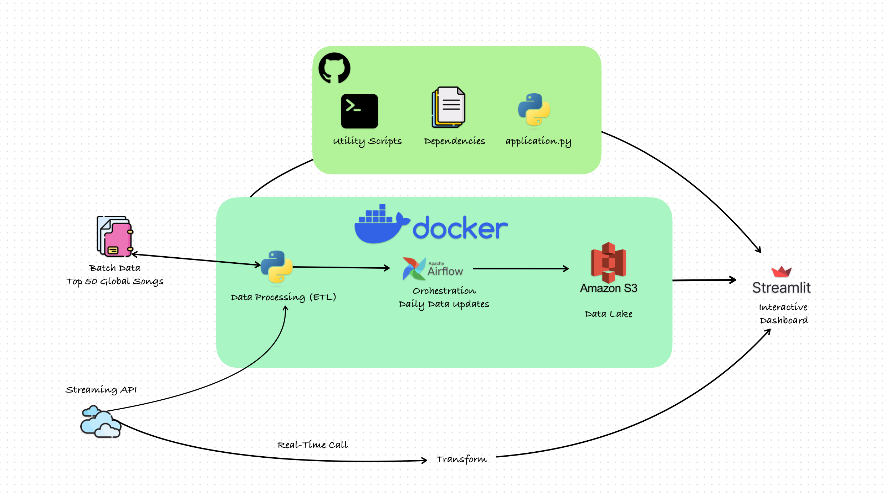

A Spotify Analytical Pipeline, which closely replicates an industry-standard data engineering pipeline on a smaller scale.

## Details about the Pages
### Authentication Page:

The Authentication page serves as the gateway for users to seamlessly connect their Spotify account, unlocking a myriad of powerful features. Users have the option to link their account either by entering their Spotify username or by authenticating through their registered email address.

### Features Unleashed:

Upon successful authentication, users gain access to a suite of dynamic features that enhance their Spotify experience:

1. **Current Trends:**
   - Provides a daily curated list of the top 50 trending songs, keeping users in the loop with the latest musical hits.

2. **Compare Playlists:**
   - Enables users to compare two playlists, whether within their own collection or with those of other users. This feature promotes playlist exploration and discovery.

3. **Playlist Variability Analysis:**
   - Delivers in-depth analytical insights into the sound features of songs, including technicality, keys, duration, and loudness. Users can gain a comprehensive understanding of their music library.

4. **Song Meta-Info:**
   - Displays detailed audio features associated with each song, offering insights into elements such as danceability, acousticness, energy, and more. This feature empowers users with a deeper understanding of the music they love.

5. **Wrapped!**
   - Replicates the popular Spotify Wrapped feature, providing users with a personalized, user-centric annual summary of their listening habits. This engaging feature offers a nostalgic journey through the user's musical journey over the year.

## Usage Guidelines:

To make the most of the Spotify Analytics App, follow these simple steps:

1. **Authentication:**
   - Begin by authenticating your Spotify account using your username or registered email.

2. **Exploration:**
   - Once authenticated, explore the diverse features, from staying updated with Current Trends to gaining insights into your music library with Playlist Variability Analysis.

3. **Comparison:**
   - Use the Compare Playlists feature to discover similarities and differences between playlists, fostering a deeper connection with your music collection.

4. **Understanding Your Music:**
   - Dive into Song Meta-Info to understand the technical aspects of your favorite songs, helping you discover new tracks that align with your musical preferences.

5. **Relive Your Year in Music:**
   - Experience the nostalgia of Wrapped! and relive your musical journey throughout the year, encapsulated in a visually appealing and personalized summary.

## Project Workflow Architecture 

### Data Retrieval and Processing

The project begins with data retrieval facilitated by the **SPOTIPY** library in Python. Leveraging this powerful library, the required information is fetched in JSON format, which is then meticulously transformed into a readable data structure.

### Scheduling and Automation with Airflow

The project employs **Apache Airflow** to schedule and refresh the list of top 50 songs on a daily basis. This systematic scheduling ensures that the data remains up-to-date, reflecting the latest trends in the dynamic world of music.

### Cloud Storage with AWS S3

For robust data storage and accessibility, **AWS S3** serves as the repository for the daily updated list of top 50 songs. This cloud-based solution not only provides secure storage but also facilitates seamless integration with other components of the project.

### Interactive User Platform with Streamlit

**Streamlit** takes center stage in crafting an engaging and interactive platform for users to explore and understand their music statistics. This user-friendly interface ensures a smooth and enjoyable experience, allowing users to effortlessly access and analyze their personalized data.

### Project Highlights:

- **Data Source:** Utilizes the SPOTIPY library to fetch comprehensive information in JSON format.
  
- **Automation:** Leverages Apache Airflow for systematic scheduling and daily refresh of the top 50 songs list.

- **Cloud Storage:** AWS S3 serves as a reliable and scalable cloud storage solution for the project.

- **User Interaction:** Employs Streamlit to create an intuitive and interactive platform, providing users with a seamless way to explore and interpret their music statistics.

This meticulously designed project workflow architecture combines the efficiency of data retrieval, the reliability of automated scheduling, the scalability of cloud storage, and the user-centric design of an interactive platform. It ensures a comprehensive and enriching experience for users seeking insights into their music preferences.

## Possible Expansion 
In the next phases of development, the project is poised to introduce additional features and richer data sets. A key highlight will be the incorporation of a comprehensive analysis page dedicated to exploring user interactions across various countries. This analytical endeavor aims to identify regions with both the highest and lowest levels of user engagement, shedding light on distinctive song habits.

## Anticipated Features:

### 1. Detailed Country Analysis Page

A specialized analysis page will delve into the diverse music consumption patterns observed in different countries. This exploration is not only intended to uncover varying levels of user interaction but also to potentially unveil intriguing insights into cultural influences on music preferences.

### 2. Transformative Impact on Culture

As a hypothesis, this investigation holds the potential to go beyond mere statistical observations. The identified patterns and trends in user behavior could spark a transformative impact on the cultural landscape of specific regions. This ambitious prospect underscores the project's broader aim of contributing to the understanding and evolution of cultural dynamics through music.

### 3. Holistic Perspective on User Behavior

By extending the focus beyond individual user statistics, the project aspires to offer a holistic perspective on how music consumption habits contribute to the fabric of societies. This forward-looking approach positions the project as a catalyst for cultural exploration and potential transformation.

## Vision for the Future

As the project evolves, these anticipated features not only expand its analytical capabilities but also underscore its commitment to fostering a deeper understanding of the profound connections between music, user behavior, and culture. The journey ahead promises to elevate the project into a catalyst for insightful discoveries and meaningful cultural impact.